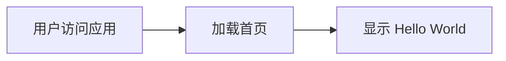

# 产品需求文档 (PRD) - Vite + React + TypeScript 项目

## 1. 产品概述

基于 Vite + React + TypeScript 的前端项目脚手架，提供清晰的项目结构和开发规范。

- **目标**：创建一个现代化的 React 前端项目模板，包含标准化的目录结构
- **用户群体**：前端开发者，用于快速启动新项目

## 2. 核心功能

### 2.1 功能模块

1. **首页 (Home)**: 展示 "Hello World" 欢迎页面，验证项目运行正常

### 2.2 页面详情

| 页面名称 | 模块名称 | 功能描述 |
|---------|---------|---------|
| 首页 | 主内容区 | 显示 "Hello World" 文本和基础样式 |
| 首页 | 页面布局 | 响应式布局，居中显示内容 |

## 3. 核心流程

## 4. 用户界面设计

### 4.1 设计风格

- **主色调**: 现代渐变色系（蓝紫渐变）
- **按钮样式**: 圆角按钮，悬停效果
- **字体**: 现代无衬线字体
- **布局**: 居中布局，卡片式容器
- **动画**: 淡入动画效果

### 4.2 页面设计概述

| 页面名称 | 模块名称 | UI 元素 |
|---------|---------|---------|
| 首页 | 主标题 | 大号 "Hello World" 文本，渐变色彩 |
| 首页 | 容器 | 圆角卡片背景，阴影效果 |
| 首页 | 副标题 | 技术栈说明文字 |

### 4.3 响应式设计

- **桌面端优先**: 以桌面端为主，适配移动端
- **移动端优化**: 小屏幕自动调整布局和字体大小
