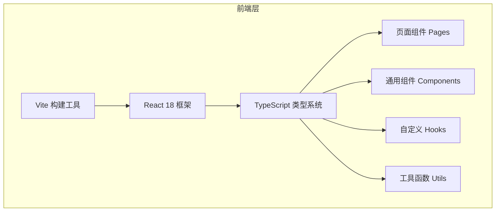

# 技术架构文档 - Vite + React + TypeScript 项目

## 1. 架构设计



## 2. 技术选型

| 技术 | 版本 | 用途 |
|-----|------|------|
| Vite | ^5.x | 构建工具和开发服务器 |
| React | ^18.x | UI 框架 |
| TypeScript | ^5.x | 类型安全 |
| 初始化工具 | create-vite | 项目初始化 |

## 3. 目录结构

```
project-root/
├── src/
│   ├── pages/          # 页面组件
│   │   └── Home.tsx    # 首页
│   ├── components/     # 可复用组件
│   ├── hooks/          # 自定义 Hooks
│   ├── utils/          # 工具函数
│   ├── App.tsx         # 根组件
│   ├── main.tsx        # 应用入口
│   └── index.css       # 全局样式
├── public/             # 静态资源
├── index.html          # HTML 模板
├── package.json        # 项目配置
├── tsconfig.json       # TypeScript 配置
├── tsconfig.app.json   # 应用 TS 配置
├── tsconfig.node.json  # Node TS 配置
├── vite.config.ts      # Vite 配置
└── README.md           # 项目说明
```

## 4. 路由定义

| 路径 | 用途 | 对应页面 |
|-----|------|---------|
| / | 首页 - 显示 Hello World | Home.tsx |

## 5. 开发命令

| 命令 | 用途 |
|-----|------|
| `npm install` | 安装依赖 |
| `npm run dev` | 启动开发服务器 |
| `npm run build` | 构建生产版本 |
| `npm run preview` | 预览生产构建 |

## 6. 关键配置说明

### 6.1 TypeScript 配置

- 严格模式启用
- 目标 ES2020
- 支持 JSX 语法
- 路径别名配置（可选）

### 6.2 Vite 配置

- 开发服务器端口：5173
- React 插件支持
- 开启热更新（HMR）
